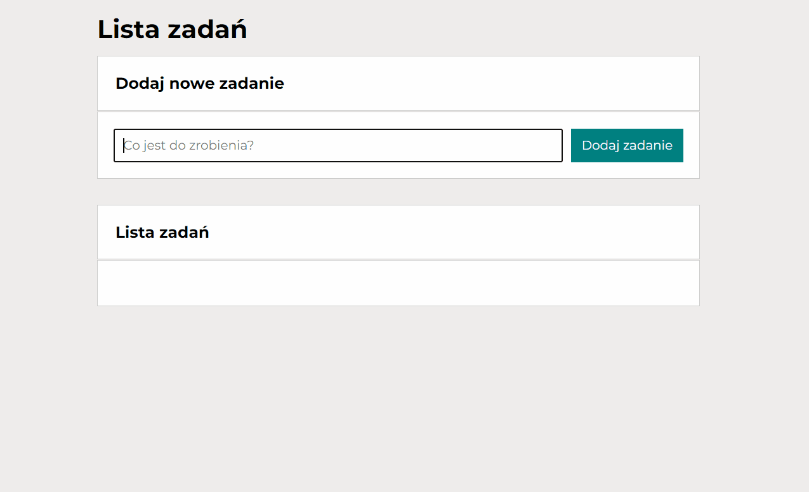

# Application that creates a task list
This repository contains an application that creates a task list.

## Demo
https://werka481.github.io/app-task-list/
## Description
The app allows you to add a to-do list. You can mark each task as done. You can also delete a task from the list. There is also a button in the application that hides or shows completed tasks. There is also a button responsible for completing all tasks at the same time. After all tasks are completed, the button becomes inactive. I invite you to watch the instructions.

## Technologies used:
1. BEM
2. CSS Flex-box
4. CSS Grid
3. ES6+ features
